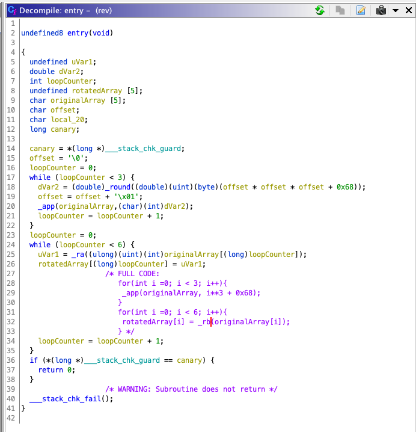
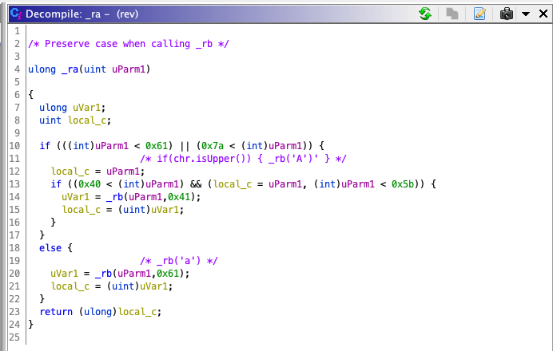
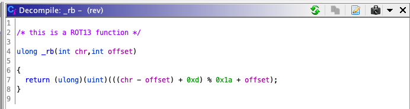

# **ReversingErirefvat**

## *Competition: TamuCTF*

## *Points: 497*

### **Challenge**

  Given assembly code, find the flag
  
### **Tools**

  GCC\
  Ghidra
  
### **Solve**

  This was much easier to read in C because I am unfamiliar with the AT&T syntax provided\
  So I compiled it:
  ```
  gcc reversingeriviferat.s -o rev
  ```

  Then, I opened it in Ghidra to use its spectacular decompiler. Things are fairly straightforward from here\
  All I did was change some variable names to make it more readable and to decipher what was happening.
  in main:
  

  we see some variables get setup and then two loops happen. In the first, 3 characters are added to an array.\
  In the second, the characters gets passed to the _ra function and replaced in a different array.

  In the _ra() function:

  

  This function merely preserves case sensitivity when calling the _rb function:

  

  Here is some tricky looking code but all it does is perform a ROT13 on the provided character

  I assumed that the only important characters for this came from our first loop so I did a ROT13 on the expected characters
  and submitted them in flag format:

  `gigem{uvc}`

