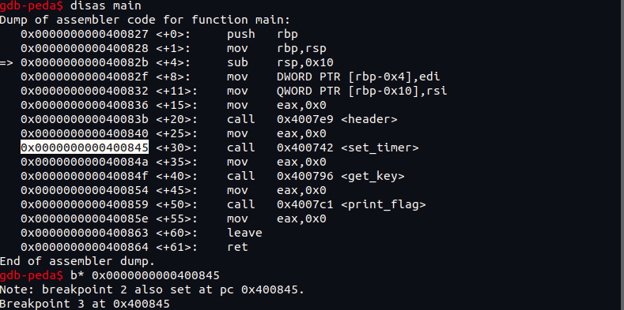

# **Be Quick Or Be Dead 1**

## *Competition: picoCTF*

## *Points: 200*

### **Challenge**

  Get the Flag from the Binary
  
### **Tools**

  GDB (with peda)\
  Ghidra (optional)
  
### **Solve**

  disassembling in ghidra shows some really easy to read C code.\
  The challenge does a slow calculation (adding 1 each cycle) and hits an alarm sig\
  before completing. All we need to do is bypass the set_alarm() function 

  

  ```
  disass main
  b* 0x400845 <--- this should correspond with set_timer function
  r
  n
  c
  ```
  and then the flag will print a couple seconds later. This works because we do the next instruction following set_timer() rather than stepping into it
