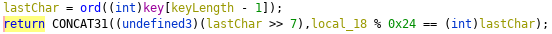

# **Keygen 1**

## *Competition: picoCTF*

## *Points: 400*

### **Challenge**

  Forge a valid key to get the flag
  
### **Tools**

  Ghidra
  
### **Solve**

  Disassembling in Ghidra allows us to read the psuedo-C code that is very straightfoward.\
  The key must be 16 characters long and comprised only of hex characters (0-9 and A-F)\
  
  
  Additionally, the ordinal sum of all characters % 35 must be equal to the ordinal value of the last character
  
  
  
  With that, we can forge ourselves a key that works: `AAAAAAAAAAAAAAA0`
